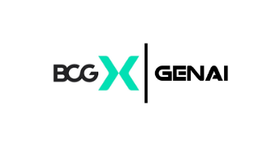

# Financial_AI_Analyst

  

<h2 align="center">Job Simulation BCG : Conception d'un ChatBOT financier </h2>

  <strong>Développer un chatbot basé sur l'IA qui analyse des documents financiers. Il s'agit d'un projet de pointe à la croisée de la finance et de l'IA générative (GenAI), un domaine d'intérêt et d'investissement en pleine croissance chez BCG.</strong>

  <a href="#Apercu">Overview</a> •
  <a href="#Ingestion des données"> Ingestion </a> •
  <a href="# Prérequis">Prérequis</a> •
  <a href="#Détection Mouvement Horizontal et Vertical">Implementation</a> •

## Apercu
Ce répertoire relate les étapes dece projet de construction d'un ChatBot AI qui Analyse les docs financiers. Je suis parti du framework RAG **LLamaIndex** pour pouvoir le mettre en place. 
C'est la toute première fois de faire un projet RAG avec le framework llamaIndex hate de voir la difference avec langChain.

  

## Prérequis
- python-dotenv
- sec-edgar-downloader
- streamlit
- plotly
- pandas
- openpyxl
- llama-index
- llama-parse
- llama-index-llms-google

## Ingestion des données

  

Dans cette étape, il s'agit de préparer les données qui serviront de base de connaissance pour notre RAG dans notre cas il s'agit des rapports financiers 10-K des entreprise Microsoft , Apple et Tesla pour l'année 2025.

Après avoir telecharger les fichier 10 K txt des differentes entreprises avec le script **downloader.py**, il fallait les parser pour qu'il deviennent exploitable pour notre moedèle, pour cela on a utiliser le script **paerser.py** qui utilise l'outil **LlamaParse** de llamaIndex